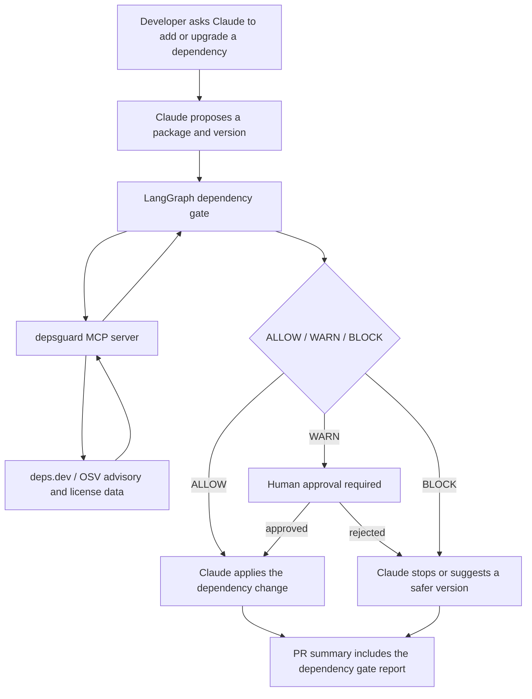

# depsguard 🛡️

[](https://github.com/oandronachi/depsguard/actions/workflows/ci.yml)
[](https://github.com/oandronachi/depsguard/actions/workflows/evals.yml)
[](./LICENSE)
[](./pyproject.toml)
[](./README.md)

**An MCP server that gives AI coding assistants the context to make safe
dependency decisions** — and a policy guardrail that returns an
`ALLOW / WARN / BLOCK` verdict an agent or CI step can act on.

depsguard is a compact AI-native SDLC demonstrator: it exposes dependency
intelligence through MCP, gives agents executable guardrails before dependency
changes, evaluates its own tool behavior through CI, and demonstrates
human-in-the-loop approval with LangGraph.

Built for an **AI-native SDLC**: when Claude Code, Cursor, or Copilot is about
to add or upgrade a dependency, depsguard feeds it decision-grade data from
[Google's deps.dev](https://deps.dev) — licenses, source, and the OSV/GHSA
security advisories affecting that exact version. Ships with an **agent skill**,
an **evaluation harness**, a **Dockerfile**, and **CI**.

Covers 7 ecosystems including the ones automotive/systems software ships in —
**Cargo (Rust)** and **Maven (Java/Kotlin)** — plus npm, PyPI, Go, NuGet,
RubyGems. **No API key. No account. Free.**

---

## Why this matters for AI-native SDLC

AI coding assistants can add or upgrade dependencies faster than humans can
review their security and licensing implications. depsguard gives the assistant
a structured tool interface and a policy verdict before code is changed.

This project demonstrates:
- MCP tool integration for AI coding assistants
- Context engineering for dependency decisions
- Guardrail-based ALLOW / WARN / BLOCK policy
- Evaluation harness for tool correctness and drift detection
- Standard Python `.venv` setup for local development and CI
- Containerized execution with locked container dependencies
- Human-readable agent instructions via SKILL.md

## Demo

See [`docs/demo.md`](docs/demo.md) for a real terminal transcript showing:

- `urllib3` 1.26.4 proposed as a dependency change
- a direct depsguard policy call
- deps.dev advisories found for that exact version
- `BLOCK` with `--max-severity medium`
- a PR-style dependency risk report

## What it does

Ask Claude *"is it safe to upgrade to this version?"* and it answers with real
advisory data — then gives a verdict it can act on.

Tools:

- `get_package_info(ecosystem, name)` returns available versions, default/latest
  version, publish dates, and deprecation flags.
- `get_version_details(ecosystem, name, version)` returns licenses, source repo,
  and advisory IDs affecting that exact version.
- `get_advisory_details(advisory_id)` returns CVSS severity, CVE aliases, and an
  OSV/GHSA advisory link.
- `evaluate_dependency_policy(...)` composes the above into an
  `ALLOW / WARN / BLOCK` guardrail verdict.

The intended flow: look up a version, get its advisory IDs, expand severity, or
just call the guardrail for a one-shot decision. The bundled
[`SKILL.md`](SKILL.md) teaches an agent exactly when and how to chain them.

## Install & run

Requires Python 3.10+. Create a project-local virtual environment and install
depsguard into it:

```bash
git clone https://github.com/oandronachi/depsguard.git
cd depsguard
python -m venv .venv
. .venv/bin/activate
python -m pip install --upgrade pip
python -m pip install -e ".[dev,examples]"
depsguard        # starts the server on stdio
```

On Windows PowerShell, activate the same venv with:

```powershell
.\.venv\Scripts\Activate.ps1
```

Verify it works without a client:

```bash
python -m pytest -q
python -m evals.run_evals          # live eval suite
npx @modelcontextprotocol/inspector depsguard
```

CI follows the same shape: create `.venv`, install the project editable with
the `dev` and `examples` extras, then run tests through the venv interpreter.

Or run it containerised:

The Dockerfile installs from `uv.lock` with `uv sync --locked`, so container
dependencies match the checked-in lockfile. By default the image installs only
the MCP server runtime. Add `INSTALL_EXAMPLES=true` to include optional example
dependencies such as LangGraph.

```bash
docker build -t depsguard .
docker run -i --rm depsguard              # -i is required: MCP speaks over stdio

docker build --build-arg INSTALL_EXAMPLES=true -t depsguard:examples .
docker run --rm --entrypoint /app/.venv/bin/python depsguard:examples \
  examples/langgraph_dependency_gate.py pypi urllib3 1.26.4 --transport mock --auto-approve-warn
```

## Connect to Claude

**Claude Desktop** — Settings → Developer → Edit Config, then add the server
entry. Use the **absolute path** to the `depsguard` executable inside `.venv`.
On Windows, that executable is `.venv\Scripts\depsguard.exe`; on macOS/Linux it
is `.venv/bin/depsguard`.

macOS/Linux:

```json
{
  "mcpServers": {
    "depsguard": {
      "command": "/absolute/path/to/depsguard/.venv/bin/depsguard",
      "args": []
    }
  }
}
```

Windows:

```json
{
  "mcpServers": {
    "depsguard": {
      "command": "C:\\absolute\\path\\to\\depsguard\\.venv\\Scripts\\depsguard.exe",
      "args": []
    }
  }
}
```

Fully quit and reopen Claude Desktop. Restarting is required after editing the
config; Desktop also launches with a minimal `PATH`, which is why the absolute
path matters.

**Claude Code** — one command:

```bash
claude mcp add depsguard -- /absolute/path/to/depsguard/.venv/bin/depsguard
```

## Try these prompts

- *"Is `urllib3` 1.26.4 safe? What CVEs affect it?"*
- *"What license does `requests` use, and what's the latest version?"*
- *"Compare the advisories in `lodash` 4.17.11 vs 4.17.21."* (npm)
- *"Tell me about advisory GHSA-2qrg-x229-3v8q."*
- *"Is Maven package `org.apache.logging.log4j:log4j-core` 2.14.1 vulnerable?"*

## How it works

Each tool is a thin, typed wrapper over a single deps.dev v3 REST endpoint,
returning compact structured data rather than raw API dumps. That keeps output
friendly to an agent's context window. The guardrail composes the lookup tools
into a decision. Built with the official
[MCP Python SDK](https://github.com/modelcontextprotocol/python-sdk) (FastMCP).
The server is **read-only** and makes no destructive or authenticated calls.

## Evals & CI

- [`evals/run_evals.py`](evals/run_evals.py) scores the tool surface on real
  packages: known-vulnerable versions, cross-ecosystem coverage, and a
  guardrail consistency invariant.
- [`.github/workflows/ci.yml`](.github/workflows/ci.yml) runs unit tests on
  every push/PR. [`.github/workflows/evals.yml`](.github/workflows/evals.yml)
  runs the live eval suite on demand and weekly to catch upstream data/API
  drift.

## LangGraph dependency gate example

[`examples/langgraph_dependency_gate.py`](examples/langgraph_dependency_gate.py)
demonstrates how depsguard can be used inside an agentic SDLC workflow:

1. A proposed dependency add/upgrade enters a LangGraph workflow.
2. The workflow calls depsguard through MCP.
3. depsguard returns `ALLOW`, `WARN`, or `BLOCK`.
4. `BLOCK` stops the change.
5. `WARN` triggers a human approval step.
6. The workflow emits a PR-style dependency risk report.

### Practical Claude workflow

A practical setup would look like this:


```mermaid
flowchart TD
    Developer["Developer asks Claude to add or upgrade a dependency"]
    Claude["Claude proposes a package and version"]
    Gate["LangGraph dependency gate"]
    Server["depsguard MCP server"]
    Data["deps.dev / OSV advisory and license data"]
    Verdict{"ALLOW / WARN / BLOCK"}
    Apply["Claude applies the dependency change"]
    Human["Human approval required"]
    Stop["Claude stops or suggests a safer version"]
    Report["PR summary includes the dependency gate report"]

    Developer --> Claude
    Claude --> Gate
    Gate --> Server
    Server --> Data
    Data --> Server
    Server --> Gate
    Gate --> Verdict
    Verdict -->|ALLOW| Apply
    Verdict -->|WARN| Human
    Human -->|approved| Apply
    Human -->|rejected| Stop
    Verdict -->|BLOCK| Stop
    Apply --> Report
    Stop --> Report
```

Example Claude prompt:

```text
Upgrade urllib3 to 1.26.4.

Before changing files:
1. Run the depsguard LangGraph dependency gate.
2. If the result is ALLOW, apply the change.
3. If the result is WARN, stop and ask me for approval.
4. If the result is BLOCK, do not apply the change. Explain why and suggest a safer version.
5. Include the dependency gate report in the PR summary.
```

Claude runs the workflow:

```powershell
python examples/langgraph_dependency_gate.py `
  pypi urllib3 1.26.4 `
  --max-severity medium `
  --json
```

Behind the scenes:

```text
Claude wants to change dependency
        |
LangGraph receives package/version
        |
LangGraph calls depsguard through MCP
        |
depsguard checks deps.dev / OSV advisory data
        |
depsguard returns verdict
        |
LangGraph converts verdict into final action/report
        |
Claude acts on that decision
```

If depsguard returns `BLOCK`, Claude should respond like:

```text
I did not update urllib3 to 1.26.4.

depsguard blocked the change because the selected version has advisories above
the configured policy threshold.

Required action:
Use a safer version or route this through security review.

Dependency gate result:
- Package: pypi:urllib3@1.26.4
- Verdict: BLOCK
- Worst severity: high
- Policy max severity: medium
```

If depsguard returns `WARN`, Claude should pause:

```text
depsguard returned WARN for this dependency change.

I need human approval before applying it.

Package: pypi:example@1.2.3
Reason: advisory severity is within warning range
Recommended action: approve only if this dependency is required and risk is accepted.

Approve this change?
```

If approved, Claude continues. If rejected, Claude stops or proposes another
version.

If depsguard returns `ALLOW`, Claude applies the change and includes a PR note
like:

```markdown
## Dependency Gate Report

- Package: `pypi:example@1.2.3`
- depsguard verdict: `ALLOW`
- Final verdict: `ALLOW`
- Required agent action: Apply the dependency change.

No blocking advisories were found under the configured policy.
```

In CI, the same workflow can become a required check:

```text
Pull request opened
        |
CI extracts changed dependencies
        |
CI runs LangGraph dependency gate
        |
ALLOW -> green check
WARN  -> pending/manual approval
BLOCK -> red check, merge blocked
```

So the real value is that Claude is no longer just "being careful" in natural
language. The dependency decision becomes an enforced workflow: Claude proposes,
depsguard evaluates, LangGraph routes, and the final report becomes part of the
PR record.

The final action is deterministic:

- `ALLOW` lets Claude continue and include the report in the PR summary.
- `WARN` pauses for human approval before Claude applies the change.
- `BLOCK` prevents the change and tells Claude to propose a safer version or
  route to security review.

Run:

```bash
# Install the optional example dependencies declared by depsguard.
python -m pip install -e ".[examples]"

# Default path: call depsguard through MCP stdio and block on medium+ advisories.
python examples/langgraph_dependency_gate.py pypi urllib3 1.26.4 --max-severity medium

# Local debugging path: call the depsguard policy function directly, without MCP stdio.
python examples/langgraph_dependency_gate.py pypi urllib3 1.26.4 --transport direct

# Non-interactive approval demo: approve WARN outcomes automatically.
python examples/langgraph_dependency_gate.py pypi urllib3 1.26.4 \
  --transport mock --auto-approve-warn

# Non-interactive rejection demo: reject WARN outcomes automatically.
python examples/langgraph_dependency_gate.py pypi urllib3 1.26.4 \
  --transport mock --reject-warn
```

## Future extension: A2A

depsguard currently focuses on the MCP tool and guardrail layer: an AI
assistant or workflow can call depsguard to evaluate dependency risk before
allowing a package change to proceed.

In a larger enterprise SDLC, this could be extended with an A2A-compatible
dependency-review agent. That agent could coordinate with separate security,
license-compliance, build-validation, and PR-generation agents, while using
depsguard as the MCP-backed policy tool for dependency intelligence.

This would keep depsguard small and focused: it remains the executable
dependency-policy service, while A2A handles cross-agent coordination across
the wider engineering workflow.

## Limitations & notes

- Advisories reflect those affecting the selected version **directly**, not
  vulnerabilities inherited from transitive dependencies. Extending the
  guardrail across a full resolved dependency graph and adding OpenSSF Scorecard
  signals are natural next features; this build scopes to the highest-signal
  tools.
- License information is advisory context, not legal advice.
- The guardrail is intentionally conservative and should be adapted per organization.
- deps.dev has **no fixed public rate limit**; the server reports HTTP 429 with
  a clear retry-later error.
- Live evals depend on upstream deps.dev/OSV data and may detect data drift.
- deps.dev data is provided by Google under
  [CC-BY 4.0](https://creativecommons.org/licenses/by/4.0/).

## License

This project is released under the MIT licence.  See the [LICENSE](LICENSE) file for details.
